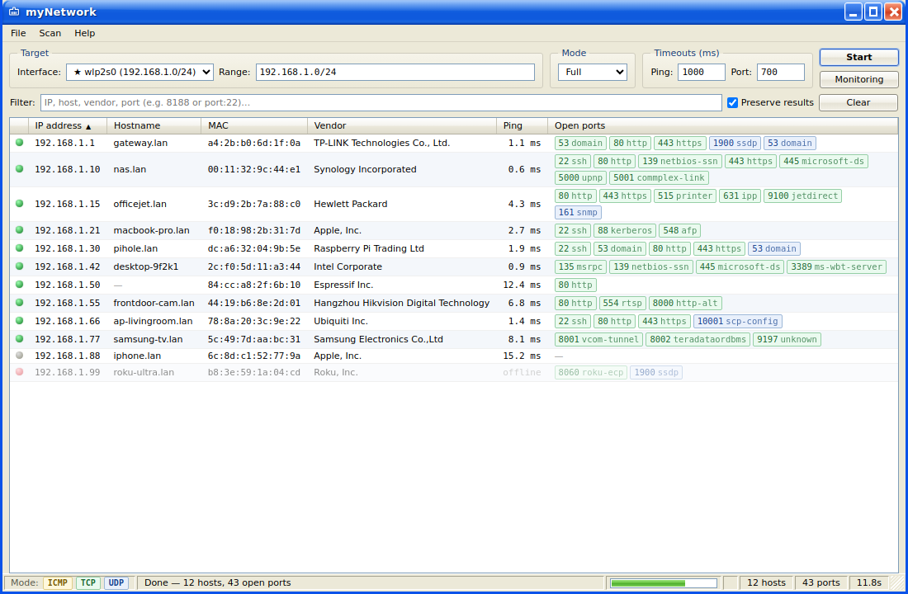

<div align="center">


# myNetwork

**Cross-platform LAN & port scanner with a Windows XP–style desktop GUI.**

Discovers hosts on your segment, resolves names, MAC and vendor, and reports open
TCP + UDP ports — with live monitoring and export.




<sub>Screenshot shows synthetic demo data.</sub>

### Download

<a href="https://github.com/ancaferro/myNetwork/releases/latest"></a>
<a href="https://github.com/ancaferro/myNetwork/releases/latest"></a>
<a href="https://github.com/ancaferro/myNetwork/releases/latest"></a>

<sub>Grabs the latest release — Windows installer (.exe), macOS (.dmg), Linux (.AppImage / .deb).</sub>

</div>

---

## ✨ Features

- **Auto-detected segment.** Interfaces and their subnets are listed automatically;
  the one holding the default gateway is first (★). If an interface has several
  addresses, **Range** is pre-filled as a comma-separated list.
- **Comma-separated ranges** — `10.0.0.0/24, 192.168.1.0/24`, single IPs or
  `a.b.c.d-a.b.c.e`.
- **Layered scanning:** first **ICMP** (discovery), then **popular ports** (fast
  feedback), then **all TCP (1–65535)** and **UDP**. Hosts and ports stream in as
  they are found; the progress bar reflects the layers.
- **Modes:** **Fast** (default) — ICMP + popular; **Full** — TCP + UDP + ICMP, all
  ports; **Custom** — separate TCP and UDP ranges.
- **Colour = protocol:** TCP green, UDP blue, ICMP yellow (legend in the status bar).
- **Vendor by MAC** — full offline **IEEE OUI** database (~39,700 entries).
- **Monitoring:** pings known hosts every minute with online/offline
  notifications and re-checks ports every 5 minutes; unreachable hosts fade out.
- **Preserve** (default) — results from previous scans are kept and merged by IP.
  A **Clear** button sits next to it.
- **Copy from a row:** click IP → IP, click MAC → MAC, click anywhere else → the
  whole host record as JSON. Export to **CSV / JSON** from the **File** menu.
- **Cache** — the last scan is restored on the next launch.
- **Windows XP (Luna) GUI** — frameless window, menu bar, sortable ListView and a
  status bar.

## 🚀 Run

```bash
npm install
npm start          # or: make start   (background, no sudo)
```

`make help` lists the targets (`start` / `stop` / `restart` / `status`).

> On Linux, Electron needs its Chromium sandbox configured. If you hit a
> `chrome-sandbox` error, use `npm run start:nosandbox` (or `make start`), or run
> once: `sudo chown root node_modules/electron/dist/chrome-sandbox && sudo chmod 4755 …`.

## 📦 Build installers

```bash
npm run dist:linux   # AppImage + deb
npm run dist:win     # NSIS installer
npm run dist:mac     # dmg
```

Releases are built automatically: pushing a `v*` tag triggers
[GitHub Actions](.github/workflows/release.yml), which builds installers for
Windows/macOS/Linux and attaches them to the GitHub Release.

## 🧭 How it works

| Layer | File | Purpose |
|-------|------|---------|
| CIDR / interfaces | [`net-utils.js`](src/scanner/net-utils.js) | target parsing, comma ranges, interface detection |
| Discovery | [`discovery.js`](src/scanner/discovery.js) | ping, ARP table, reverse DNS, default route |
| Ports | [`ports.js`](src/scanner/ports.js) | TCP connect, UDP probes, service names |
| OUI vendors | [`oui.js`](src/scanner/oui.js) · [`oui-db.txt`](src/scanner/oui-db.txt) | vendor by MAC |
| Orchestration | [`index.js`](src/scanner/index.js) | layers, socket pool, streamed events |
| Electron / IPC | [`main.js`](src/main.js) · [`preload.js`](src/preload.js) | window, monitoring, export, notifications |
| Renderer | [`renderer/`](src/renderer) | UI, table, filter |

Everything runs on plain Node — **no native dependencies and no root** — so it
builds identically on Linux, macOS and Windows.

## ⚠️ Responsible use

This tool is meant for auditing **your own** networks. Only scan segments you are
authorised to.

## License

MIT
